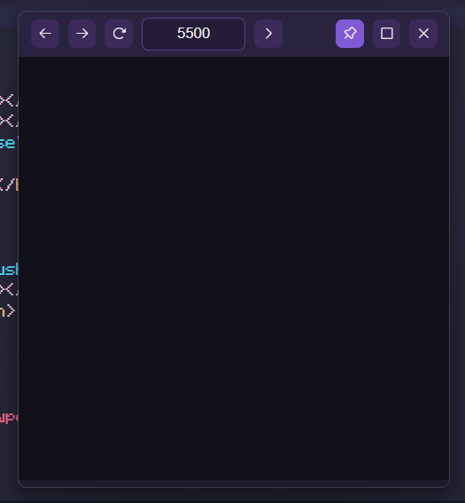
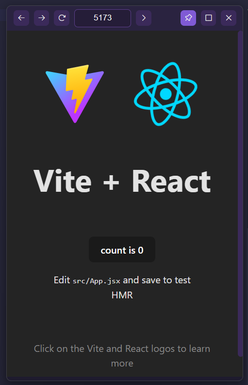
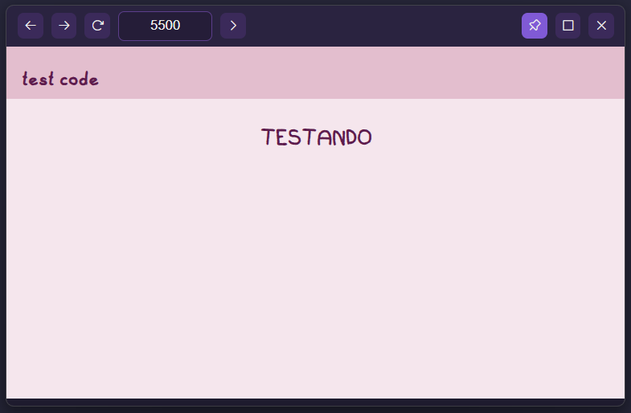

# 🌙 Luma MiniBrowser

<div align="center">
  
  <p>Um minibrowser para desenvolvedeores </p>
  
  
  
</div>

Um minibrowser feito em **Electron**.
O **Luma** permite visualizar páginas locais (ex: `Live Server` do VSCode `ou qualquer outro localhost`) em uma janelinha sempre por cima,
com botões básicos de navegação!

---

## 📸 Preview

  


---

## ✨ Funcionalidades

- 📌 **Always on top**
- ⛵ **Navegação básica**: Voltar, Avançar e Recarregar  
- ⚡ **Carregamento rápido** de qualquer porta `localhost` (ex: `http://localhost:5500`)
  
---

## 🛠️ Tecnologias

- [Electron](https://www.electronjs.org/)
- **HTML + CSS + JS** para a UI
---

## Como executar

1. Clonar o repositório:
   ```bash
   git clone https://github.com/seu-usuario/luma-minibrowser.git
   cd luma-minibrowser
   ```
2. Instalar as dependências:

   ```bash
   npm install
   ```

3. Iniciar:

   ```bash
   npm start
   ```

